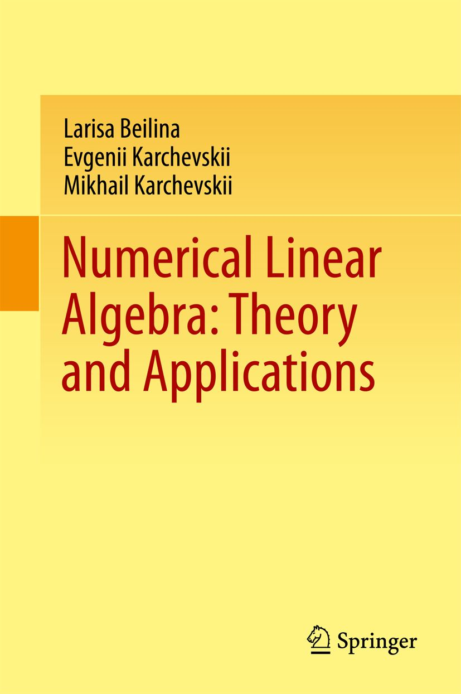

# Springer Source Code

This repository accompanies [*Numerical Linear Algebra Theory*](http://www.springer.com/us/book/9783319573021) by Larisa Beilina, Evgenii Karchevskii, and Mikhail Karchevskii (Springer, 2017).

Download the files as a zip using the green button, or clone the repository to your machine using Git.

## Releases

Release v1.0 corresponds to the code on SpringerLink, without corrections or updates.

